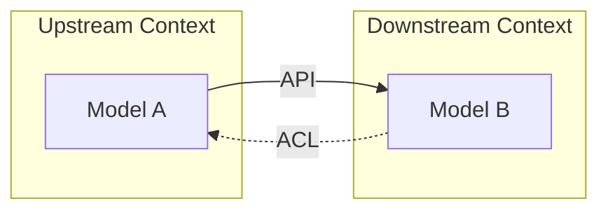

# 3단계: 전략적 패턴(Strategic Patterns)

- 참고 : Chat GPT5
- [소스코드](../ddd-strategic-patterns)

전술적 패턴이 바운디드 캔텍스트 내부 구현에 집중한다면, 전략적 패턴은 컨텍스트 간 경계를 정의하고 협력하는 것에 초점을 두게된다.

## 전략적 패턴의 핵심 개념

- 바운디드 컨텍스트 (Bounded Context) : 도메인 모델이 명확하게 정의되고 일관된 의미를 가지는 경계다. 각 바운디드 컨텍스트는 독립적으로 개발, 배포, 유지보수 될 수 있다.
- 컨텍스트 맵 (Context Map) : 바운디드 컨텍스트 간의 관계와 상호작용을 시각적으로 표현한 것이다. 이를 통해 컨텍스트 간의 의존성을 이해하고 관리할 수 있다.
- 통합 패턴 (Integration Patterns) : 바운디드 컨텍스트 간의 데이터와 모델을 어떻게 공유할지 정의하는 협력 방식이다.

또한 전략적 패턴은 도메인 주도 설계의 큰 그림을 이해하는 데 도움을 준다. 아래에서는 주요 전략적 패턴에 대해서 정리하겠다.

### 1. 컨텍스트 매핑 (Context Mapping)

여러 바운디드 컨텍스트 간의 관계를 정의하고 시각화 한다. 각 컨텍스트는 독립된 모델을 가지므로 통합 저점에서 협력 방식을 정의해야 한다. 이때 대표적인 컨텍스트 매핑 패턴은 다음과 같다.

- 공유 커널 (Shared Kernel) : 두 컨텍스트가 일부 모델을 공유한다.
- 고객-공급자 (Customer-Supplier) : 하나의 컨텍스트가 제공하면 다른 컨텍스트가 제공된 모델을 소비한다. 이떄 소비하는 컨텍스트를 소비자라 표현한다. (Upstream, Downstream 으로
  표현하기도 한다.)
- 컨텍스트 호환 (Conformist) : 한 컨텍스트가 다른 컨텍스트에 종송되어 있다.
- 안티코럽션 레이어 (Anti-Corruption Layer) : 외부 모델을 내부 모넬로 변환하는 보호계층으로 하류 컨텍스트가 상류 모델에 의존하지 않는다.
- Separate Ways : 두 컨텍스트가 완전히 독립적으로 존재한다. 이는 두 컨텍스트간에 협력이 아예 단절되어 있기 때문에 각자 동립적으로 해결하게 된다.



다이어그램을 보게 되면 Upstream 과 Downstream 으로 구성되어 있다. 이에 대해서 설명하면 다음과 같다.

1. Upstream Context

- 역할 : 자신의 도메인 모델(Model A)을 소유하고 관리하는 역할을 한다.
- 책임 : Model A 를 정의하여 갖고 있으며 이를 API(Rest API, gRPC, 메시지 이벤트 등) 을 통해 외부에 제공한다.
- 특징 : 다른 컨텍스트들이 필요하다면 반드시 이 API 를 통해서 Model A 를 가져가야 한다.

2. Downstream Context

- 역할 : Upstream Context 가 제공하는 모델(Model A)을 소비하는 역할을 한다.
- ACL(Anti-Corruption Layer) : Model A 를 가져와서 자신의 도메인 모델(Model B) 에 통합하거나 변환하여 사용한다.
- 특징 : Model B 는 Downstream 에 독립적으로 정의된 모델로 Upstream 모델의 변화가 직접정인 영향을 줄여 도메인의 고유성을 유지할 수 있다.

아래는 각 컨텍스트 매핑 패턴에 대한 간단한 예시이다.

### Anti-Corruption Layer (ACL)

ACL은 외부 시스템이나 컨텍스트 모델 내부에서 컨텍스트를 오염시키지 않도록 보호하는 패턴이다. 이를 통해 외부 모델의 변화가 내부 모델에 직접적인 영향을 미치지 않도록 한다.
이러한 ACL 은 보통 Translator, Adapter, Facade 등의 디자인 패턴을 활용하여 구현한다.

먼저 Upstream 과 Downstream 의 데이터 구조가 다음과 같다고 가정하자.

- Upstream 데이터 구조

```java
package com.study.acl.upstream;

public record ExternalInvoiceDto(
    String invoiceId,
    String orderId,
    String customerId,
    String status
) {
}
```

- Downstream 데이터 구조

```java
package com.study.acl.downstream;

import java.util.UUID;

public record InvoiceSummary(
    UUID invoiceId,
    UUID orderId,
    UUID customerId,
    Status status
) {

    public enum Status {
        ISSUED, SETTLED, CANCELLED
    }
}
```

아래 는 ACL 을 구현한 예시이다.

#### 1. Translator

```java
public class InvoiceTranslator {
    public InvoiceSummary toDomain(ExternalInvoiceDto externalInvoice) {
        return new InvoiceSummary(
            UUID.fromString(externalInvoice.invoiceId()),
            UUID.fromString(externalInvoice.orderId()),
            UUID.fromString(externalInvoice.customerId()),
            mapStatus(externalInvoice.status())
        );
    }

    private InvoiceSummary.Status mapStatus(String s) {
        return switch (s) {
            case "SETTLED" -> InvoiceSummary.Status.SETTLED;
            case "CANCELLED" -> InvoiceSummary.Status.CANCELLED;
            default -> InvoiceSummary.Status.ISSUED;
        };
    }
}
```

Translator 은 외부 모델(Upstream Context Model) 을 내부 모델(Downstream Context Model) 로 변환하는 책임만 갖는다.

- 비즈니스 호출 없음
- 외부 네트워크 호출 없음
- 순수 함수형으로 테스트가 쉬움
- 모델 스키마 변화에 대한 완충지대

이러한 Translator 는 외부 DTO 스키마가 자주 바뀌거나 내부 VO 와 개념 용어가 다른 경우에 유용하다. 또한 표현의 차이가 있는 경우에도 유용하다.

#### 2. Adapter

```java
public interface BillingPort {
    InvoiceSummary findInvoiceByOrderId(UUID orderId);

    void settleInvoice(UUID invoiceId, String method);
}

public interface BillingClient {
    ExternalInvoiceDto getInvoiceByOrderId(String string);

    void payInvoice(String string, String method);
}
```

먼저 BillingPort 는 Downstream Context 가 의존하는 인터페이스다. BillingClient 는 Upstream Context 에서 제공하는 인터페이스다.

```java
public class BillingAdapter implements BillingPort {
    private final BillingClient billingClient;
    private final InvoiceTranslator invoiceTranslator;


    public BillingAdapter(BillingClient billingClient, InvoiceTranslator invoiceTranslator) {
        this.billingClient = billingClient;
        this.invoiceTranslator = invoiceTranslator;
    }

    @Override
    public InvoiceSummary findInvoiceByOrderId(UUID orderId) {
        ExternalInvoiceDto externalInvoice = billingClient.getInvoiceByOrderId(orderId.toString());
        return invoiceTranslator.toDomain(externalInvoice);
    }

    @Override
    public void settleInvoice(UUID invoiceId, String method) {
        billingClient.payInvoice(invoiceId.toString(), method);
    }
}
```

여기서 주요한 점은 Port 는 내부 의존 인터페이스로 이를 이용해서 어댑터를 구현한다. 이러한 아래와 같은 특성을 갖는다.

- 네트워크 호출 존재
- 도메인 규칙/비즈니스로직 없음
- 예외/타입/리턴값을 내부 규약으로 변환
- Translator 를 내부에서 활용

#### 3. Facade

```java
public record OrderSettlementResult(
    InvoiceSummary invoice,
    boolean paymentSettled,
    UUID shipmentId
) {
}

public interface ShippingPort {
    UUID createShipment(UUID orderId, String address);
}

public class UpstreamFacade {
    private final BillingPort billingPort;
    private final ShippingPort shippingPort;


    public UpstreamFacade(BillingPort billingPort, ShippingPort shippingPort) {
        this.billingPort = billingPort;
        this.shippingPort = shippingPort;
    }

    public OrderSettlementResult settleAndShip(UUID orderId, String paymentMethod, String address) {
        InvoiceSummary invoice = billingPort.findInvoiceByOrderId(orderId);
        billingPort.settleInvoice(invoice.invoiceId(), paymentMethod);
        UUID shipmentId = shippingPort.createShipment(orderId, address);
        return new OrderSettlementResult(invoice, true, shipmentId);
    }
}
```

Facade 는 여러 외부 호출, 모델을 하나의 고수준 API 로 묶어 Downstream 에 제공하는 역할을 한다.

- 여러 외부 시스템 호출
- 유스케이스 흐름이 생길 수 있음
- Adapter 와 Translator 여러개를 조합해서 활용 후 내부 규약에 맞게 반환

이러한 Facade 는 Downstream 입장에서 여러 외부 시스템을 한 번에 처리하고 싶을때 또는 컨트롤러/애플리케이션 서비스가 외부 호출을 직접 많이 알지 않도록 캡슐화 할 때 사용한다.

#### 4. 정리

| 패턴         | 책임                      | 특징                                                      | 사용 시점                    |
|------------|-------------------------|---------------------------------------------------------|--------------------------|
| Translator | 외부 모델 -> 내부 모델 변환       | 순수 함수형, 비즈니스 로직 없음, 테스트 용이, 표현 차이 조정                    | 외부 스키마 자주 변경, 표현 차이      |
| Adapter    | 외부 인터페이스 -> 내부 인터페이스 변환 | 네트워크 호출, 외부 예외를 내부 예외로 변환, Port-Adapter 구조              | 외부 API 호출, 내부 의존성 캡슐화    |
| Facade     | 여러 외부 호출을 하나의 API로 묶음   | 유스케이스 흐름 오케스트레이션, 기술적 제어(리트라이, 폴백, 로깅 등) 포함, 비즈니스 규칙 없음 | 여러 외부 시스템 호출, 복잡한 흐름 캡슐화 |    

## Partnership & Team Organization

전략적 패턴은 기술적 통합 방식뿐만 아니라 조직 구조까지도 고려된다. 예를 들어, 바운디드 컨텍스트 별로 독립된 팀을 구성하여 각 팀이 자신의 컨텍스트를 책임지고 관리하도록 할 수 있다. 이를 통해 팀 간의 의사소통 비용을 줄이고, 각 팀이 자신의 도메인에 집중할 수 있도록 한다.

- Partnership : 두 팀이 긴밀하게 협력하여 공동의 목표를 달성하는 방식이다. 예를 들어, 고객-공급자 관계에서 두 팀이 정기적으로 소통하고 피드백을 주고받으며 협력한다.
- Open Host Service(OHS) : 한 팀이 다른 팀에게 안정적이고 명확한 인터페이스를 제공하여, 다른 팀이 이를 통해 서비스를 이용할 수 있도록 한다. 이를 통해 팀 간의 의존성을 줄이고, 각 팀이 독립적으로 발전할 수 있도록 한다.
- Published Language : 팀 간의 의사소통을 위해 공통된 언어와 모델을 정의한다. 이를 통해 오해를 줄이고, 협업을 원활하게 한다.

## 전략적 패턴의 장점 

- 큰 시스템을 컨텍스트 단위로 나누어 복잡성을 관리할 수 있다. 
- 컨텍스트 간 의존 관계를 명확시 하여 팀 협력 구조를 설계 가능하다. 
- ACL 같은 패턴으로 외부 시스템 의존성을 격리할 수 있다. 
- 조직 구조까지 설계에 반영이 가능하다. 

이러한 전략적 패턴에 대한 주요 패턴은 실전 프로젝트 진행시 반드시 고려해야 할 중요한 요소다.