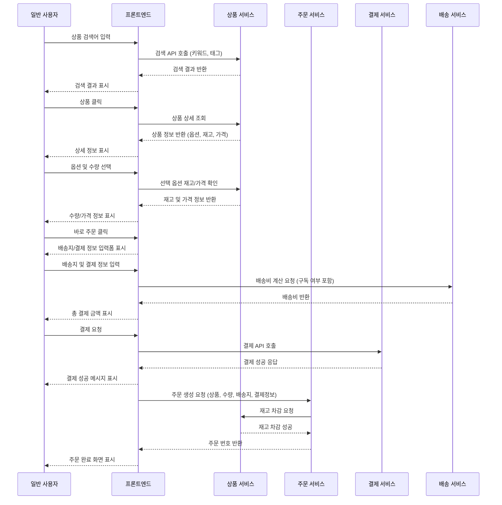
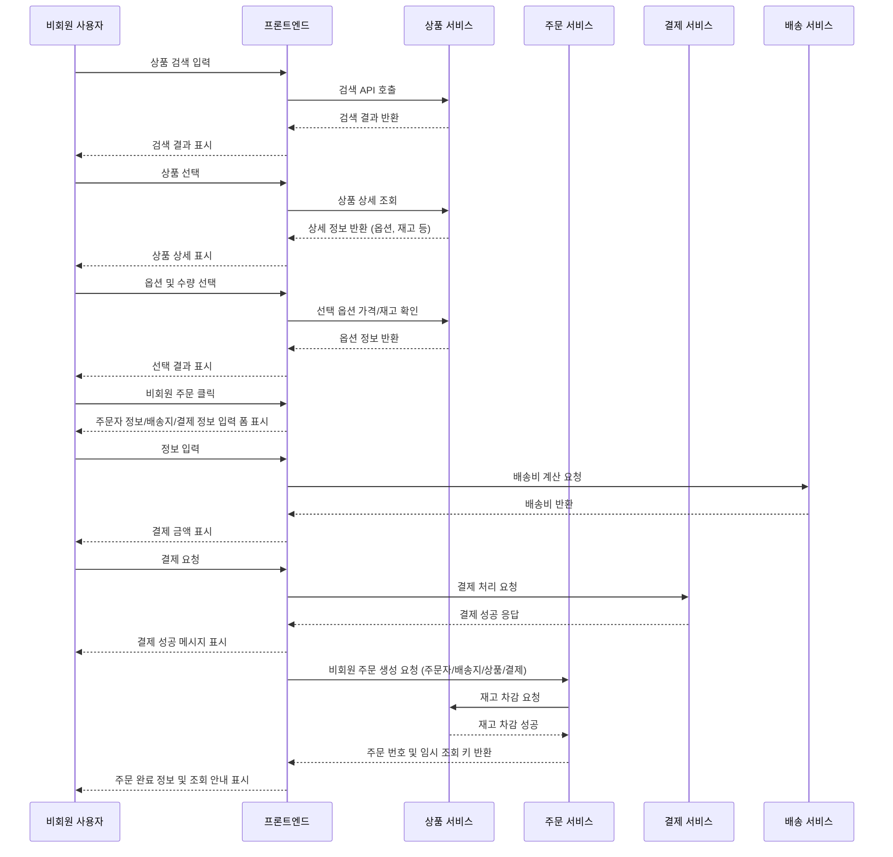
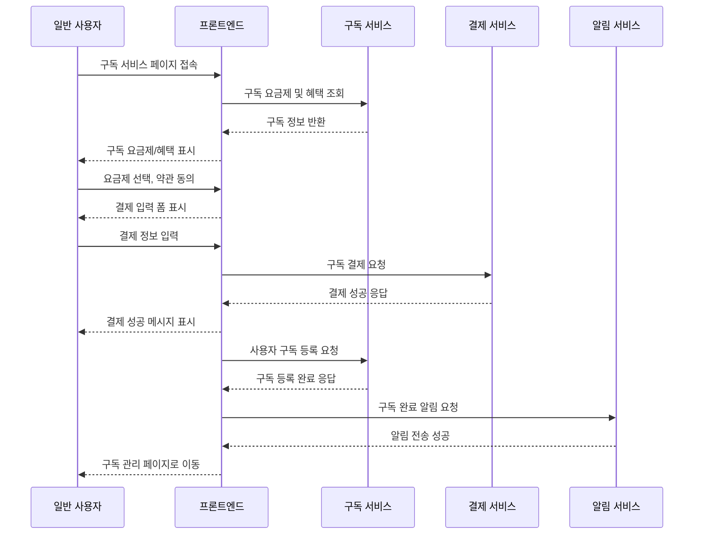
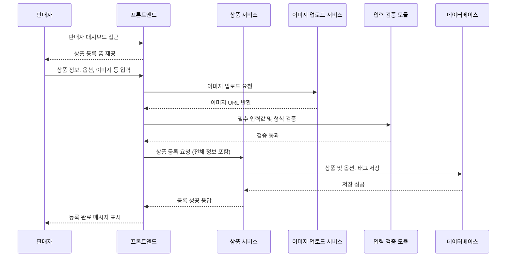
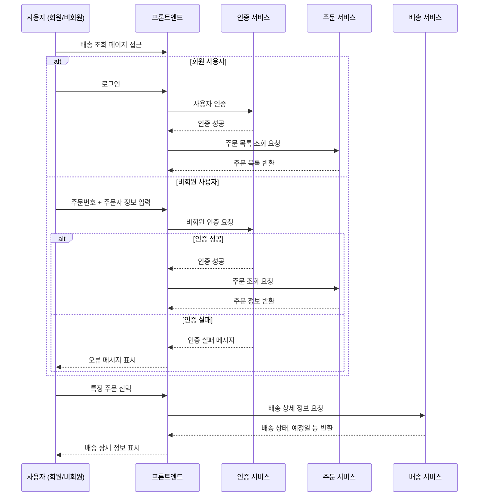
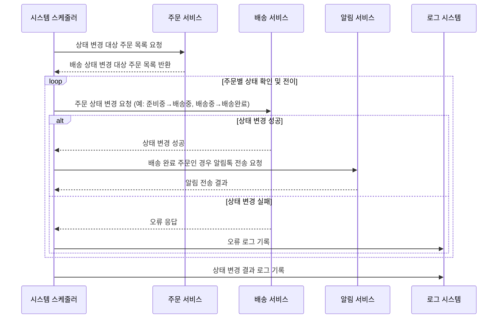
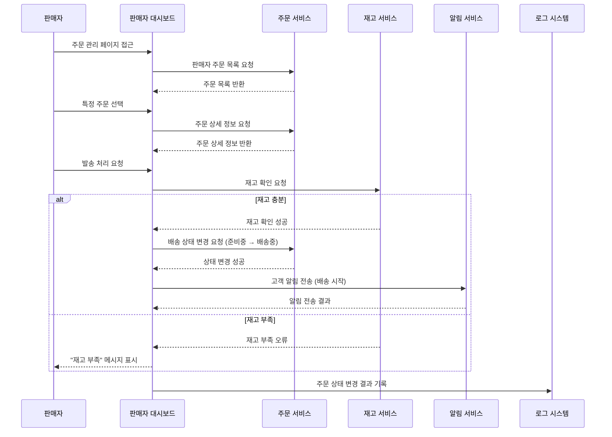
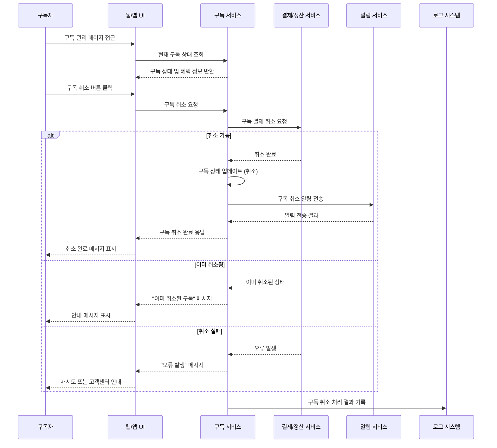
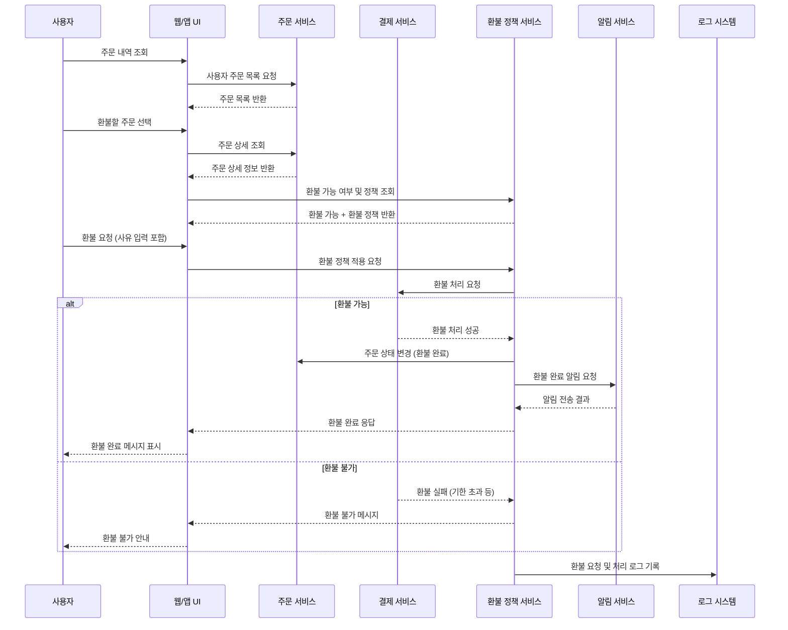

# 5단계; 실전 프로젝트 - 요구사항 정리 및 유스케이스 다이어그램

> 토이프로젝트 주제를 선정해서 목적을 정하고 `Chat GPT` 를 활용해 요구사항을 도출하고 정리하였음

여기서 진행할 프로젝트는 전자상거래 시스템에 구독서비스를 적용해서 운영하는 시나리오이다.
여기서 일반적인 전자상거래 시스템을 제공하며, 일반 사용자 및 비회원은 상품을 검색하고 주문할 수 있으며, 배송조회 또한 가능하다.
여기서 구독 서비스를 이용해서 PV 상품에 대해서 배송비 무료 혜택을 받을수 있도록 제공한다.

간단하게 정리하면 쿠팡 로켓배송을 모티브로 삼아서, 구독 서비스를 통해서 배송비 무료 혜택을 제공하는 시나리오이다.

## 1. 요구사항 도출 및 유비쿼터스 언어 정의 (케이스 스터디)

### 1.1 요구사항 도출 - 기능적 요구사항

1. 사용자 등록 및 로그인 (일반 사용자, 판매자, 관리자)
2. 상품 등록 및 관리 (판매자, PV 상품 관리자)
3. 옵션 기반 상품 구성 (색상, 사이즈 등)
4. 상품 태그 설정 및 검색 필터 기능
5. 일반 사용자 및 비회원의 주문 기능
6. 구독(PV) 회원 전용 배송비 무료 적용
7. 장바구니 기능 또는 바로 주문
8. 결제 처리 (모의 처리)
9. 배송 상태 전이 (준비중 -> 배송중 -> 배송 완료)
10. 자동 배송 상태 변경 서비스 (스케줄러 기반 서비스)
11. 배송 조회 기능 (일반 사용자, 비회원, 판매자, 관리자)
12. 배송 완료시 알림톡 전송 (일반 사용자)
13. 주문 완료시 판매자 페이지에서 주문 내역 확인 기능
14. 구독 서비스 등록/결제/취소
15. 사용자별 추천 상품 노출
16. 비회원 주문 정보 일회성 입력

### 1.2 요구사항 도출 - 비기능적 요구사항

1. **확장성** : 향후 정기구독 외 다른 멤버십 기능도 확장 가능하도록
2. **유지보수성** : 도메인 중심의 구조로 기능별 독립성이 확보되어야 함
3. **성능** : 검색/추천 기능은 사용자 응답을 빠르게 반환해야 함
4. **보안** : 주문/결제 정보 및 사용자 정보등 암호화 및 접근 제어 필요
5. **신뢰성** : 결제 및 주문 처리의 일관성 보장
6. **가용성** : 주문 및 배송 로직은 서비스 중단 없이 처리되어야 함
7. **이벤트 기반 확장 가능성** : 주문, 배송 등 주요 이벤트를 외부로 발행할 수 있어야 함

### 1.3 유비쿼터스 언어 정의

| 용어        | 영문                      | 정의                                    |
|-----------|-------------------------|---------------------------------------|
| 카탈로그      | Catalog                 | 상품 목록 및 검색 기능을 제공하는 도메인               |
| 상품        | Product                 | 판매자가 등록하는 판매 대상 아이템                   |
| 옵션        | Option                  | 상품의 세부 속성 (색상, 사이즈 등)                 |
| 추천상품      | Recommended Product     | 사용자의 구매 이력 및 선호도를 기반으로 추천되는 상품        |
| 주문        | Order                   | 사용자가 상품을 구매하는 행위                      |
| 주문 항목     | Order Item              | 주문에 포함된 개별 상품 및 옵션                    |
| 배송비       | Delivery Fee            | 상품 배송에 부과되는 비용                        |
| 배송 요청일    | Requested Delivery Date | 사용자가 원하는 배송 날짜                        |
| 배송 상태     | Delivery Status         | 주문의 배송 진행 상태 (준비중, 배송중, 배송 완료)        |
| 장바구니      | Cart                    | 사용자가 구매를 위해 담아두는 상품 목록                |
| 관리자       | Admin                   | 시스템을 관리하고 운영하는 사용자                    |
| 판매자       | Seller                  | 상품을 등록하고 관리하는 사용자                     |
| 판매자 페이지   | Seller Dashboard        | 판매자가 자신의 상품 및 주문을 관리하는 페이지            |
| 일반 사용자    | Regular User            | 상품을 검색하고 주문하는 사용자                     |
| 비회원 사용자   | Guest User              | 회원 가입 없이 주문하는 사용자                     |
| PV 상품 관리자 | PV Product Manager      | PV 상품 및 구독 서비스를 관리하는 사용자              |
| 구독자       | Subscriber              | PV 구독 서비스를 이용하는 사용자                   |
| PV 상품     | PV Product              | 구독 회원 전용 혜택이 적용되는 상품                  | 
| PV 구독     | PV Subscription         | 구독 회원이 구독하는 서비스                       | 
| 정기 구독 상태  | Subscription Status     | 구독 서비스의 현재 상태 (활성, 비활성 등)             |
| 태그        | Tag                     | 상품에 부여되는 키워드로, 검색 필터링에 사용됨            |
| 알림        | Notification            | 배송 완료 등 주요 이벤트 발생 시 사용자에게 알림을 전송하는 기능 |
| 결제        | Payment                 | 사용자가 주문한 상품에 대해 대금을 지불하는 행위           |
| 결제 정보     | Payment Info            | 결제에 필요한 상세 정보 (카드 정보 등)               |
| 자동화 서비스   | Automation Service      | 배송 상태 변경 등 반복 작업을 자동으로 처리하는 서비스       |

> 유비쿼터스 언어는 도메인 성숙도에 따라 지속적으로 발전하고 변경될 수 있다. 따라서 정기적으로 도메인 전문가와 협력하여 용어집을 업데이트하는 것이 중요하다.

### 1.4 요구사항 정리

#### 요구사항 ID 체계

| 코드 Prefix | 설명                                     | 
|-----------|----------------------------------------|
| FR-       | 기능적 요구사항 (Functional Requirement)      |
| NFR-      | 비기능적 요구사항 (Non-Functional Requirement) |

#### 구현 우선순위

| 분류  | 설명                                           |
|-----|----------------------------------------------|
| MVP | 최소 기능 제품 (Minimum Viable Product) - 필수 구현 기능 |
| 2순위 | 1차 릴리즈 이후 추가 구현 기능                           |
| 3순위 | 향후 고려 가능한 기능                                 |

#### 요구사항 목록

| 요구사항 ID   | 요구사항 설명                          | 우선순위 | 비고        |
|-----------|----------------------------------|------|-----------|
| FR-001-01 | 일반 사용자, 판매자, 관리자 회원가입 및 로그인 기능   | 높음   | MVP       |
| FR-001-02 | 사용자 역할별 접근 제어                    | 높음   | MVP       |
| FR-002-01 | 상품 등록/수정/삭제                      | 높음   | MVP       |
| FR-002-02 | 상품 태그 등록/해제                      | 중간   | 2순위       |
| FR-003-01 | 옵션 추가(색상, 사이즈 등)                 | 중간   | MVP       |
| FR-003-02 | 옵션 선택시 가격/재고 자동 반영               | 중간   | MVP       |
| FR-004-01 | 상품 태그 기반 검색 기능                   | 중간   | MVP       |
| FR-004-02 | 다중 필터링(카테고리, 가격대, 태그 등)          | 중간   | 2순위       |
| FR-004-03 | 상품 검색 및 상세 조회                    | 높음   | MVP       |
| FR-005-01 | 일반 사용자 주문 기능                     | 높음   | MVP       |
| FR-005-02 | 비회원 주문 기능                        | 중간   | 2순위       |
| FR-005-03 | 비회원 주문 시 일회성 주소/결제 정보 입력 기능      | 중간   | 2순위       |
| FR-006-01 | 구독 회원 배송비 무료 적용 (구독 + PV 상품)     | 높음   | MVP       |
| FR-006-02 | 그 외(비구독 및 PV 외 상품) 배송비 부과 기능     | 높음   | MVP       |
| FR-007-01 | 장바구니에 상품 담기                      | 중간   | MVP       |
| FR-007-02 | 장바구니에서 바로 주문 기능                  | 중간   | 2순위       |
| FR-008-01 | 결제 처리 (모의 처리)                    | 높음   | MVP       |
| FR-008-02 | 결제 실패 처리 및 재시도 기능                | 중간   | MVP, 예외처리 |
| FR-008-03 | 결제 정보 저장 및 관리                    | 중간   | 2순위       |
| FR-009-01 | 배송 상태 전이 (준비중 -> 배송중 -> 배송 완료)   | 높음   | MVP       |
| FR-009-02 | 배송 상태 예외처리 : 잘못된 상태 전이 차단        | 높음   | 예외처리      |
| FR-010-01 | 자동 배송 상태 변경 서비스 (스케줄러 기반)        | 중간   | MVP       |
| FR-011-01 | 배송 조회 기능 (일반 사용자, 비회원, 판매자, 관리자) | 높음   | MVP       |
| FR-012-01 | 배송 완료시 알림톡 전송 기능                 | 중간   | 2순위       |
| FR-013-01 | 판매자 페이지에서 주문 내역 확인 기능            | 중간   | 2순위       |
| FR-013-02 | 판매자 발송 처리 기능                     | 중간   | 2순위       |
| FR-013-03 | 재고 부족시 발송 차단 기능                  | 중간   | 예외처리      |
| FR-013-04 | 상품 별 입고 처리 기능                    | 낮음   | 3순위       |
| FR-013-05 | 월별/분기별 판매 통계 기능                  | 낮음   | 3순위       |
| FR-014-01 | PV 구독                            | 높음   | 2순위       |
| FR-014-02 | 구독 결제 기능                         | 높음   | 2순위       |
| FR-014-03 | 구독 취소 기능                         | 높음   | 2순위       |
| FR-015-01 | 사용자별 추천 상품 노출 기능                 | 낮음   | 3순위       |  
| FR-016-01 | 결제 취소 및 환불 기능                    | 중간   | 2순위       |
| FR-016-02 | 배송 상태에 따른 환불 정책 적용               | 중간   | 2순위       |
| FR-017-01 | 주소 정보 누락/불일치 시 사용자에게 입력 요청       | 중간   | 예외처리      |
| FR-017-02 | 결제 정보 누락/불일치 시 사용자에게 입력 요청       | 중간   | 예외처리      |
| NFR-001   | 확장성 확보                           | 높음   |           |
| NFR-002   | 유지보수성 확보                         | 높음   |           |
| NFR-003   | 성능 최적화                           | 높음   |           |
| NFR-004   | 보안 강화                            | 높음   |           |
| NFR-005   | 신뢰성 확보                           | 높음   |           |
| NFR-006   | 가용성 확보                           | 높음   |           |
| NFR-007   | 이벤트 기반 확장 가능성 확보                 | 중간   |           |
| NFR-008   | 로그 및 모니터링 시스템 구축                 | 중간   |           |

## 2. 유스케이스 다이어그램

아래는 요구사항에 대한 주요한 액터와 그에 따른 유스케이스들을 분류한 텍스트 기반의 다이어그램 형태 초안이다. 이후 `mermaid` 를 활용해 시각화 할 예정이다.

### 주요 액터

- 일반 사용자 (Regular User)
- 비회원 사용자 (Guest User)
- 판매자 (Seller)
- 관리자 (Admin)
- PV 상품 관리자 (PV Product Manager)

### 유스케이스 그룹

#### 공통

- 로그인/회원가입 (FR-001-01)
- 역할 기반 접근 제어 (FR-001-02)

#### 일반 사용자/비회원 사용자

- 상품 검색 및 상세 조회 (FR-004-03)
- 필터/태그 기반 검색 (FR-004-01, FR-004-02)
- 장바구니 기능 (FR-007-01, FR-007-02)
- 상품 옵션 선택 (FR-003-01, FR-003-02)
- 주문 생성 (FR-005-01, FR-005-02, FR-005-03)
- 결제 처리 (FR-008-01, FR-008-02, FR-008-03)
- 배송 조회 (FR-011-01)
- 배송 상태 알림 (FR-012-01)
- 구독 서비스 등록/결제/취소 (FR-014-01, FR-014-02, FR-014-03)
- 추천 상품 노출 (FR-015-01)
- 결제 취소 및 환불 (FR-016-01, FR-016-02)
- 주소/결제 정보 입력 요청 (FR-017-01, FR-017-02)
- PV 회원 배송비 무료 적용 (FR-006-01, FR-006-02)

#### 판매자/PV 상품 관리자

- 상품 등록/수정/삭제 (FR-002-01)
- 상품 태그 관리 (FR-002-02)
- 주문 내역 확인 (FR-013-01)
- 발송 처리 (FR-013-02, FR-013-03)
- 재고 관리 (FR-013-04)
- 판매 통계 조회 (FR-013-05)

#### 관리자

- 시스템 관리 및 모니터링 (NFR-008)
- 사용자 관리 (FR-001-01, FR-001-02)

#### 시스템

- 자동 배송 상태 변경 (FR-010-01)
- 이벤트 발행 (NFR-007)
- 로그 및 모니터링 (NFR-008)
- 보안 관리 (NFR-004)
- 성능 최적화 (NFR-003)
- 확장성 및 유지보수성 확보 (NFR-001, NFR-002)
- 신뢰성 및 가용성 확보 (NFR-005, NFR-006)

### 유스케이스 시나리오

#### UC-001: 일반 사용자 상품 주문 시나리오

**주 액터**: 일반 사용자  
**목표**: 상품을 검색하고 주문을 완료한다  
**사전 조건**: 사용자가 로그인되어 있다

**정상 흐름**:

1. 사용자가 상품을 검색한다 (태그 또는 키워드 기반)
2. 시스템이 검색 결과를 표시한다
3. 사용자가 원하는 상품을 선택한다
4. 시스템이 상품 상세 정보를 표시한다 (옵션, 가격, 재고 포함)
5. 사용자가 상품 옵션(색상, 사이즈 등)을 선택한다
6. 시스템이 선택된 옵션에 따른 가격과 재고를 업데이트한다
7. 사용자가 수량을 선택하고 장바구니에 담거나 바로 주문한다
8. 사용자가 배송 정보를 입력한다
9. 시스템이 배송비를 계산한다 (구독 회원인 경우 PV 상품 배송비 무료 적용)
10. 사용자가 결제 정보를 입력한다
11. 시스템이 결제를 처리한다
12. 시스템이 주문을 생성하고 주문 번호를 발급한다
13. 시스템이 주문 확인 정보를 사용자에게 표시한다

**예외 흐름**:

- 2a. 검색 결과가 없는 경우: "검색 결과가 없습니다" 메시지 표시
- 6a. 선택한 옵션의 재고가 부족한 경우: "재고 부족" 메시지 표시 및 다른 옵션 선택 유도
- 11a. 결제 실패: 결제 실패 메시지 표시 및 재시도 옵션 제공
- 12a. 주문 생성 실패: 시스템 오류 메시지 표시 및 고객센터 안내

##### 시퀀스 다이어그램

#### UC-002: 비회원 사용자 주문 시나리오

**주 액터**: 비회원 사용자  
**목표**: 회원가입 없이 상품을 주문한다  
**사전 조건**: 없음

**정상 흐름**:

1. 비회원 사용자가 상품을 검색한다
2. 시스템이 검색 결과를 표시한다
3. 사용자가 원하는 상품을 선택한다
4. 시스템이 상품 상세 정보를 표시한다
5. 사용자가 상품 옵션과 수량을 선택한다
6. 사용자가 "비회원 주문" 버튼을 클릭한다
7. 시스템이 비회원 주문 정보 입력 폼을 표시한다
8. 사용자가 주문자 정보(이름, 연락처)를 입력한다
9. 사용자가 배송지 정보를 입력한다
10. 사용자가 결제 정보를 입력한다
11. 시스템이 배송비를 계산한다 (비회원은 일반 배송비 적용)
12. 시스템이 결제를 처리한다
13. 시스템이 주문을 생성하고 주문 번호를 발급한다
14. 시스템이 주문 조회용 임시 인증 정보를 생성한다
15. 시스템이 주문 완료 정보와 주문 조회 방법을 표시한다

**예외 흐름**:

- 8a. 필수 정보 누락: "필수 정보를 입력해주세요" 메시지 표시
- 9a. 배송지 정보 불완전: 주소 검색 기능 제공 및 재입력 유도
- 12a. 결제 실패: 결제 방법 변경 또는 재시도 옵션 제공

##### 시퀀스 다이어그램

#### UC-003: 구독 서비스 가입 시나리오

**주 액터**: 일반 사용자  
**목표**: PV 구독 서비스에 가입하여 배송비 무료 혜택을 받는다  
**사전 조건**: 사용자가 로그인되어 있다
**정책**:

- PV 구독 상태이며 PV 상품일 경우 배송비 무료 적용
- 구독 해지 즉시 무료 배송 혜택 종료

**정상 흐름**:

1. 사용자가 구독 서비스 페이지에 접근한다
2. 시스템이 구독 서비스 혜택과 요금제를 표시한다
3. 사용자가 원하는 구독 요금제를 선택한다
4. 시스템이 구독 약관과 결제 정보를 표시한다
5. 사용자가 약관에 동의한다
6. 사용자가 구독 결제 정보를 입력한다
7. 시스템이 구독 결제를 처리한다
8. 시스템이 사용자를 구독자로 등록한다
9. 시스템이 구독 완료 알림을 사용자에게 전송한다
10. 시스템이 구독 관리 페이지로 이동한다

**예외 흐름**:

- 7a. 구독 결제 실패: 결제 방법 변경 또는 재시도 옵션 제공
- 8a. 이미 구독 중인 경우: "이미 구독 중입니다" 메시지 표시 및 구독 관리 페이지로 이동

##### 시퀀스 다이어그램

#### UC-004: 판매자 상품 등록 시나리오

**주 액터**: 판매자  
**목표**: 새로운 상품을 시스템에 등록한다  
**사전 조건**: 판매자로 로그인되어 있다

**정상 흐름**:

1. 판매자가 판매자 대시보드에 접근한다
2. 판매자가 "상품 등록" 메뉴를 선택한다
3. 시스템이 상품 등록 폼을 표시한다
4. 판매자가 상품 기본 정보(이름, 설명, 가격)를 입력한다
5. 판매자가 상품 이미지를 업로드한다
6. 판매자가 상품 옵션(색상, 사이즈 등)을 설정한다
7. 판매자가 각 옵션별 재고 수량을 입력한다
8. 판매자가 상품 태그를 설정한다
9. 판매자가 PV 상품 여부를 선택한다
10. 시스템이 입력된 정보를 검증한다
11. 판매자가 "등록" 버튼을 클릭한다
12. 시스템이 상품을 등록한다
13. 시스템이 등록 완료 메시지를 표시한다

**예외 흐름**:

- 10a. 필수 정보 누락: "필수 정보를 입력해주세요" 메시지 표시
- 10b. 잘못된 가격 형식: "올바른 가격을 입력해주세요" 메시지 표시
- 12a. 상품 등록 실패: 시스템 오류 메시지 표시 및 재시도 옵션 제공

##### 시퀀스 다이어그램

#### UC-005: 배송 상태 조회 시나리오

**주 액터**: 일반 사용자, 비회원 사용자  
**목표**: 주문한 상품의 배송 상태를 확인한다  
**사전 조건**: 유효한 주문이 존재한다

**정상 흐름**:

1. 사용자가 배송 조회 페이지에 접근한다
2. 시스템이 조회 방법을 선택하도록 안내한다 (로그인 조회 / 비회원 조회)
   3a. 회원인 경우: 사용자가 로그인한다
   3b. 비회원인 경우: 사용자가 주문번호와 주문자 정보를 입력한다
4. 시스템이 사용자 인증을 확인한다
5. 시스템이 해당 사용자의 주문 목록을 조회한다
6. 사용자가 조회하고 싶은 주문을 선택한다
7. 시스템이 선택된 주문의 상세 배송 정보를 표시한다
    - 주문 상품 정보
    - 현재 배송 상태 (준비중/배송중/배송완료)
    - 배송 예정일 또는 배송 완료일
    - 배송지 정보

**예외 흐름**:

- 3b-4a. 비회원 인증 실패: "주문 정보를 확인해주세요" 메시지 표시
- 5a. 주문 내역이 없는 경우: "주문 내역이 없습니다" 메시지 표시

**배송 상태 정의**:

- 준비중(READY): 주문이 접수되어 상품 준비 중
- 배송중(SHIPPED): 상품이 출고되어 배송 중
- 배송완료(DELIVERED): 상품이 고객에게 배송 완료
- 취소(CANCELED): 주문이 취소됨

##### 시퀀스 다이어그램

#### UC-006: 자동 배송 상태 변경 시나리오

**주 액터**: 시스템 스케줄러  
**목표**: 주문의 배송 상태를 자동으로 업데이트한다  
**사전 조건**: 배송 상태 변경이 필요한 주문이 존재한다

**정상 흐름**:

1. 스케줄러가 정해진 시간에 실행된다
2. 시스템이 배송 상태 변경 대상 주문들을 조회한다
3. 시스템이 각 주문에 대해 다음 단계로 상태를 변경한다:
    - 준비중 → 배송중 (주문 후 1일 경과)
    - 배송중 → 배송완료 (배송 시작 후 2일 경과)
4. 시스템이 상태 변경된 주문에 대해 이벤트를 발행한다
5. 배송 완료된 주문의 경우, 시스템이 고객에게 알림을 전송한다
6. 시스템이 처리 결과를 로그에 기록한다

**예외 흐름**:

- 3a. 상태 변경 실패: 오류 로그 기록 및 관리자 알림
- 5a. 알림 전송 실패: 재시도 큐에 추가

##### 시퀀스 다이어그램

#### UC-007: 판매자 주문 관리 시나리오

**주 액터**: 판매자  
**목표**: 자신의 상품에 대한 주문을 확인하고 관리한다  
**사전 조건**: 판매자로 로그인되어 있고, 상품 주문이 존재한다

**정상 흐름**:

1. 판매자가 판매자 대시보드에 접근한다
2. 판매자가 "주문 관리" 메뉴를 선택한다
3. 시스템이 해당 판매자의 상품 주문 목록을 표시한다
4. 판매자가 특정 주문을 선택한다
5. 시스템이 주문 상세 정보를 표시한다:
    - 주문 상품 정보
    - 주문자 정보
    - 배송지 정보
    - 주문 상태
    - 결제 정보
6. 판매자가 필요에 따라 다음 작업을 수행한다:
    - 발송 처리 (준비중 → 배송중)
    - 주문 취소 처리
    - 고객과의 메모 작성
7. 시스템이 변경사항을 저장한다
8. 시스템이 상태 변경 시 관련 이벤트를 발행한다

**예외 흐름**:

- 6a. 재고 부족으로 발송 불가: "재고가 부족합니다" 메시지 표시
- 6b. 이미 배송 중인 주문 취소 시도: "배송 중인 주문은 취소할 수 없습니다" 메시지 표시

##### 시퀀스 다이어그램

#### UC-008: 구독 취소 시나리오

**주 액터**: 구독자  
**목표**: PV 구독 서비스를 취소한다  
**사전 조건**: 사용자가 구독 서비스에 가입되어 있다

**정상 흐름**:

1. 구독자가 구독 관리 페이지에 접근한다
2. 시스템이 현재 구독 상태와 혜택 정보를 표시한다
3. 구독자가 "구독 취소" 버튼을 클릭한다
4. 시스템이 구독 취소 안내와 주의사항을 표시한다
5. 구독자가 취소 사유를 선택한다 (선택사항)
6. 구독자가 취소를 확인한다
7. 시스템이 구독을 취소 처리한다
8. 시스템이 취소일부터 구독 혜택을 중단한다
9. 시스템이 구독 취소 완료 알림을 전송한다
10. 시스템이 구독 관리 페이지를 업데이트한다

**예외 흐름**:

- 7a. 취소 처리 실패: "일시적 오류가 발생했습니다" 메시지 표시 및 재시도 유도
- 8a. 이미 취소된 구독: "이미 취소된 구독입니다" 메시지 표시

##### 시퀀스 다이어그램

#### UC-009: 환불 처리 시나리오

**주 액터**: 일반 사용자  
**목표**: 주문을 취소하고 환불을 요청한다  
**사전 조건**: 환불 가능한 주문이 존재한다

**정상 흐름**:

1. 사용자가 주문 내역에서 환불할 주문을 선택한다
2. 시스템이 해당 주문의 환불 가능 여부를 확인한다
3. 사용자가 "환불 요청" 버튼을 클릭한다
4. 시스템이 환불 정책과 절차를 안내한다
5. 사용자가 환불 사유를 선택한다
6. 사용자가 환불 요청을 확인한다
7. 시스템이 배송 상태에 따른 환불 정책을 적용한다:
    - 배송 전: 전액 환불
    - 배송 중: 배송비 제외 환불
    - 배송 완료: 반품 후 환불
8. 시스템이 환불을 처리한다
9. 시스템이 환불 완료 알림을 전송한다

**예외 흐름**:

- 2a. 환불 불가능한 주문: "환불 기간이 지났거나 환불 불가능한 상품입니다" 메시지 표시
- 8a. 환불 처리 실패: "환불 처리 중 오류가 발생했습니다" 메시지 표시 및 고객센터 안내

##### 시퀀스 다이어그램

### 유스케이스 정리 표

| 유스케이스 ID | 유스케이스 명           | 주 액터            | 목표                             | 사전 조건                      | 우선순위 | 비고  |
|----------|-------------------|-----------------|--------------------------------|----------------------------|------|-----|
| UC-001   | 일반 사용자 상품 주문 시나리오 | 일반 사용자          | 상품을 검색하고 주문을 완료한다              | 사용자가 로그인되어 있다              | 높음   | MVP |
| UC-002   | 비회원 사용자 주문 시나리오   | 비회원 사용자         | 회원가입 없이 상품을 주문한다               | 없음                         | 중간   | 2순위 |
| UC-003   | 구독 서비스 가입 시나리오    | 일반 사용자          | PV 구독 서비스에 가입하여 배송비 무료 혜택을 받는다 | 사용자가 로그인되어 있다              | 중간   | 2순위 |
| UC-004   | 판매자 상품 등록 시나리오    | 판매자             | 새로운 상품을 시스템에 등록한다              | 판매자로 로그인되어 있다              | 중간   | MVP |
| UC-005   | 배송 상태 조회 시나리오     | 일반 사용자, 비회원 사용자 | 주문한 상품의 배송 상태를 확인한다            | 유효한 주문이 존재한다               | 높음   | MVP |
| UC-006   | 자동 배송 상태 변경 시나리오  | 시스템 스케줄러        | 주문의 배송 상태를 자동으로 업데이트한다         | 배송 상태 변경이 필요한 주문이 존재한다     | 중간   | MVP |
| UC-007   | 판매자 주문 관리 시나리오    | 판매자             | 자신의 상품에 대한 주문을 확인하고 관리한다       | 판매자로 로그인되어 있고, 상품 주문이 존재한다 | 중간   | 2순위 |
| UC-008   | 구독 취소 시나리오        | 구독자             | PV 구독 서비스를 취소한다                | 사용자가 구독 서비스에 가입되어 있다       | 중간   | 2순위 |
| UC-009   | 환불 처리 시나리오        | 일반 사용자          | 주문을 취소하고 환불을 요청한다              | 환불 가능한 주문이 존재한다            | 중간   | 2순위 |

