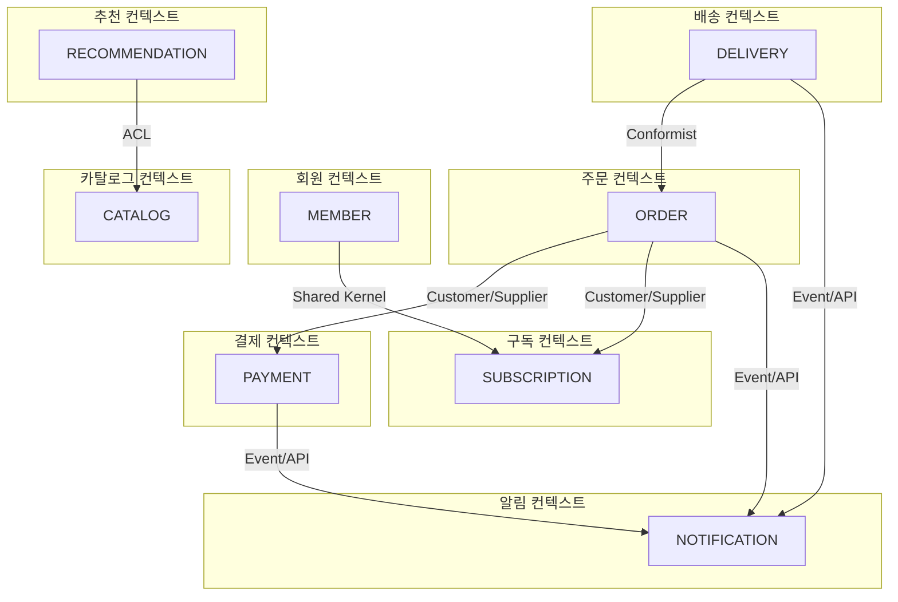
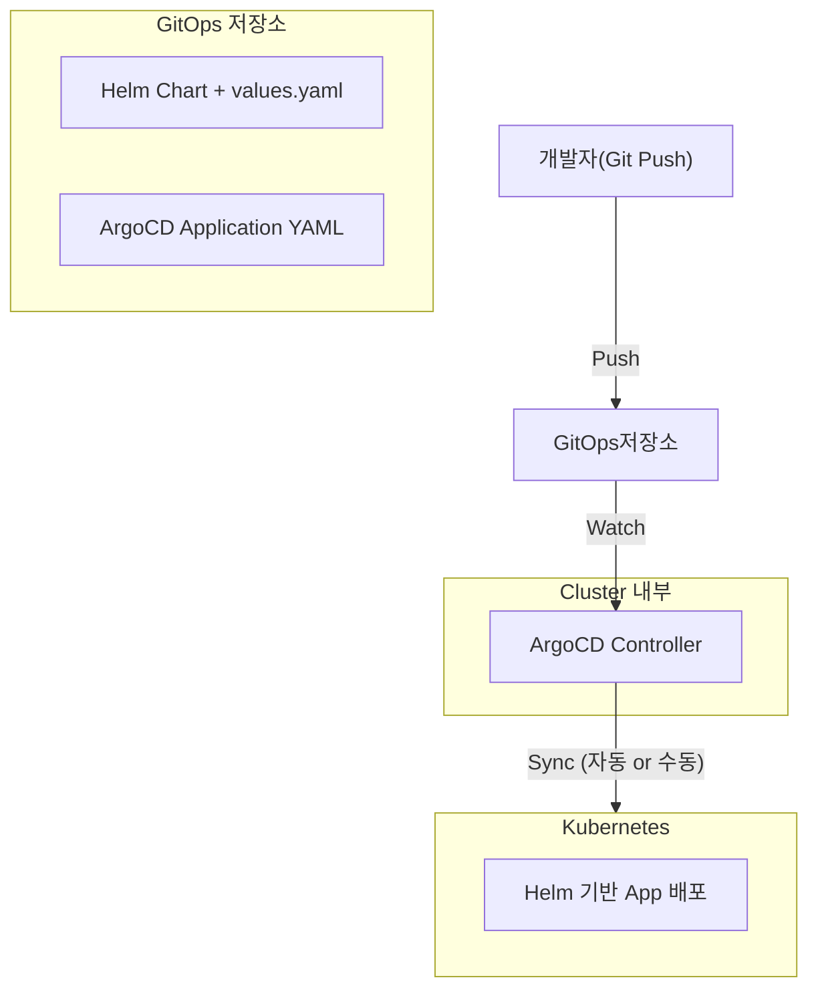
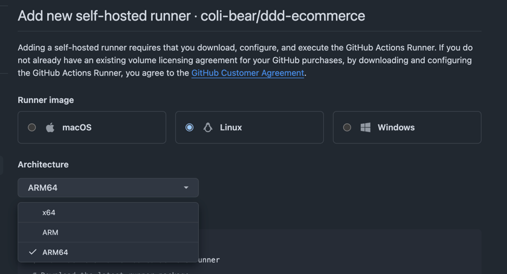

# 5단계; 실전 프로젝트 - Bounded Context 식별 및 시스템 아키텍처

이제 바운디드 컨텍스트를 식별하고 시스템 아키텍처를 설계해보자. 먼저 바운디드 컨텍스트를 도출하고 그 다음으로 시스템 아키텍처와 개발 스팩에 대해 정리하겠다.

## 1. 바운디드 컨텍스트 도출

앞서 정리한 요구사항을 기반으로 정리한 바운디드 컨텍스트는 다음과 같다.

> [실전 프로젝트 - 요구사항 분석 및 유스케이스 다이어그램](05.hands-on-01.requirements-definition-and-analysis.md)에서 도출한 요구사항을 참고하여 바운디드 컨텍스트를
> 도출하였다.

| 바운디드 컨텍스트 | 주요 책임 및 도메인 모델                         | 관련 유스케이스                       |
|-----------|----------------------------------------|--------------------------------|
| 회원 컨텍스트   | 사용자 등록, 로그인, 역할관리, 구독 여부 관리            | UC-001, UC-002, UC-003, UC-008 |
| 카탈로그 컨텍스트 | 상품 등록/수정, 옵션, 태그, PV 상품 여부, 검색/필터      | UC-001, UC-002, UC-004         |
| 주문 컨텍스트   | 장바구니, 주문 생성, 주문 항목, 결제 트리거, 배송비 계산, 환불 | UC-001, UC-002, UC-009         |
| 배송 컨텍스트   | 배송 상태 변경, 자동 상태 전이, 배송 조회, 발송 처리       | UC-005, UC-006, UC-007         |
| 구독 컨텍스트   | PV 구독 등록/결제/취소, 배송비 정책 적용, 구독자 관리      | UC-003, UC-008                 |
| 알림 컨텍스트   | 알림톡 전송, 상태 변경 알림                       | UC-006, UC-009                 |
| 결제 컨텍스트   | 결제 정보 저장, 결제, 결제 실패 재시도, 환불            | UC-001, UC-002, UC-009         |
| 추천 컨텍스트   | 사용자별 추천 상품 노출, 관심사 기반 필터링              | UC-001                         | 

### 컨텍스트 간 관계

| 관계 유형                      | 적용 컨텍스트              | 설명                                              |
|----------------------------|----------------------|-------------------------------------------------|
| 공유 커널 (Shared Kernel)      | 회원 컨텍스트<-> 구독 컨텍스트   | 회원 정보와 구독 여부가 함께 관리될 수 있음                       |
| 고객-공급자 (Customer-Supplier) | 주문 컨텍스트 -> 결제 컨텍스트   | 주문이 결제 컨텍스트에 의존함                                |
| 고객-공급자 (Customer-Supplier) | 주문 컨텍스트 -> 구독 컨텍스트   | 주문 시 배송비 정책 적용을 위해 구독 상태를 참조함                   |
| 컨텍스트 호환 (Conformist)       | 배송 컨텍스트 -> 주문 컨텍스트   | 배송 컨텍스트가 주문 컨텍스트에 종속됨                           |
| 안티코럽션 레이어 (ACL)            | 추천 컨텍스트 -> 카탈로그 컨텍스트 | 추천 컨텍스트가 상품 정보를 조회할 때 별도의 번역 계층 필요              | 
| Open Host Service          | 여러 컨텍스트 -> 알림 컨텍스트   | 알림 컨텍스트는 공개된 API 를 통해 외부 요청을 받음 (이벤트 기반 메시지 처리) |

#### 컨텍스트 매핑 다이어그램



## 2. 시스템 아키텍처 설계 및 개발 스팩 정리

### 아키텍처 방향성

| 항목         | 설명                                |
|------------|-----------------------------------|
| 아키텍처 스타일   | MSA (Microservices Architecture)  |
| 배포 환경      | 자가 구축 오케스트레이션(Kubernetes) 환경      |
| 서비스간 통신    | RESTful API                       | 
| 비동기 통신     | 이벤트 기반 메시지 큐 (Kafka)              |
| 서비스 디커플링   | 이벤트 발행/구독 구조 및 API Gateway 기반 라우팅 |
| 데이터 저장소 분리 | 각 바운디드 컨텍스트 별 DB 분리               |

> 서비스 디커플링이란?
> 서비스 간의 결합도를 낮추어 독립적으로 개발, 배포, 확장할 수 있도록 하는 것을 의미한다.
> 이를 통해 한 서비스의 변경이 다른 서비스에 미치는 영향을 최소화하고, 시스템의 유연성과 유지보수성을 향상시킨다.

### 주요 컴포넌트

#### 클러스터 인프라 컴포넌트

| 컴포넌트                 | 역할                                             | 
|----------------------|------------------------------------------------|
| Kubernetes Cluster   | 전체 서비스 오케스트레이션 및 배포 관리                         | 
| Ingress Controller   | 외부 요청을 각 서비스로 라우팅                              |
| API Gateway          | 클라이언트 -> MSA 진입점으로 인증, 라우팅, 로깅등 담당             |
| Service Mesh         | 서비스 간 통신, 보안, 관찰성 제공 (예: Istio)                |
| Message Broker       | 비동기 이벤트 발행/구독 (Kafka)                          |
| Monitoring & Logging | 시스템 상태 모니터링 및 로그 관리 (Prometheus, Grafana, ELK) |
| CI/CD                | GitHub Actions, ArgoCD, Jenkins 등              |

#### 마이크로 서비스 컴포넌트

| 컴포넌트     | 기능                     | 연계시스템                 |
|----------|------------------------|-----------------------|
| 회원 서비스   | 회원가입, 로그인, 역할, 구독여부 관리 | RDBMS (PostgreSQL)    |
| 구독 서비스   | 구독 상품, 요금제, 상태 관리      | RDBMS (PostgreSQL)    |
| 카탈로그 서비스 | 상품, 옵션, 태그, 검색/필터 관리   | RDBMS (PostgreSQL)    |
| 주문 서비스   | 장바구니, 주문, 배송비 계산       | RDBMS (PostgreSQL)    |
| 결제 서비스   | 결제 요청/결과 처리, 결제 정보     | RDBMS (PostgreSQL)    |
| 배송 서비스   | 배송 상태, 자동 상태 전이, 발송 처리 | RDBMS (PostgreSQL)    |
| 알림 서비스   | 카카오 알림톡 전송, 이벤트 알림     | Redis + 3rd Party API |
| 추천 서비스   | 검색 기록 기반 추천            | Redis + Elasticsearch |
| 검색 서비스   | 상품 키워드/태그 검색           | Elasticsearch         |

> 각 서비스는 독립적인 API 및 DB 를 가지며 필요한 경우 이벤트 또는 API 를 통해 상호작용한다.

### 공통 인프라/보안 구성

| 항목        | 설명                                     |
|-----------|----------------------------------------|
| 인증/인가     | JWT + API Gateway 기반 인증 및 권한 관리        |
| 오류 추적/로깅  | ELK 스택 활용                              |
| 서비스 헬스 체크 | Kubernetes Liveness/Readiness Probe 활용 |
| 배포 전략     | Canary 배포 전략 활용                        | 

### 개발 스팩

| 항목       | 설명                               |
|----------|----------------------------------|
| 인프라      | Kubernetes(내부망), Helm            |
| 프로그래밍 언어 | Java 17 이상, Spring Boot 3.x      |
| Database | PostgreSQL, Redis, Elasticsearch |
| API 문서화  | Swagger                          | 
| 테스트      | JUnit, Mockito 기반 단위/통합 테스트      |
| CI/CD    | GitHub Actions, ArgoCD           |
| 로컬 개발 환경 | Docker Compose                   |

> 참고 : 위 개발 스팩에서 GitHub Actions 로 CI/CD 파이프라인을 구축하고 ArgoCD 로 쿠버네티스 클러스터에 배포하는 방식을 선택했다.
> 하지만 배포를 위한 해당 클러스터는 온프레미스 내부망에 구성되어 있어 GitHub 에 직접 접근이 불가능하다.
> 따라서 `GitHub Self-hosted Runner` 를 내부망에 설치하여 Github Actions 워크플로우가 내부에서 실행되도록 구성할 예정이다.
> 이 방식은 외부 접근 없이도 CI/CD 파이프라인을 트리거하고 내부망 환경에서 ArgoCD 를 통해 안전하게 배포할 수 있는 장점이 있다.  
> 
> ```mermaid
> sequenceDiagram
> participant Dev as 개발자
> participant GitHub as GitHub
> participant Runner as Self-hosted Runner (내부망)
> participant ArgoCD as ArgoCD (내부망)
> participant K8s as Kubernetes Cluster (내부망)
> 
> Dev->>GitHub: git push
> GitHub-->>Runner: 워크플로우 트리거 (Actions)
> Runner->>Runner: Build / Test / Docker 이미지 생성
> Runner->>GitHub: 이미지 Push (ex: GitHub Container Registry)
> Runner->>ArgoCD: 배포 정의 파일 업데이트 (Helm/Kustomize 등)
> ArgoCD->>K8s: Manifest Sync 및 배포
> ```

## 사전 인프라 구성 

> Kubernetes 는 설치되어있다 가정한다. 

### GitOps + Helm + ArgoCD 




#### 1. ArgoCD &? Helm Chart 구성

> Helm 은 미리 설치되어있어야 한다. 되어있지 않다면 [Helm 설치 가이드](https://helm.sh/docs/intro/install/)를 참고하여 설치한다.

##### 1단계: ArgoCD 설치

> ArgoCD 는 쿠버네티스의 CRD(Custom Resource Definition)와 컨트롤러를 사용해 동작한다. 그래서 보통은 클러스터 안에 설치하게 되며, 설치 후에는 ArgoCD 가 Git Repository 와 클러스터 리소스를 비교해 동기화 한다.

ArgoCD 설치는 다음의 명령어로 진행한다.

```bash
$ kubectl create namespace argocd
$ kubectl apply -n argocd -f https://raw.githubusercontent.com/argoproj/argo-cd/stable/manifests/install.yaml
```

먼저 argocd 네임스페이스를 생성하고, ArgoCD 설치 매니페스트를 적용한다. 아래의 명령어를 실행해서 아래와 같이 ArgoCD 관련 파드들이 정상적으로 실행되는지 확인한다.

```bash
$ kubectl get po -n argocd
NAME                                                READY   STATUS    RESTARTS   AGE
argocd-application-controller-0                     1/1     Running   0          89s
argocd-applicationset-controller-7f8cf4fccd-k9vc4   1/1     Running   0          89s
argocd-dex-server-5476578f87-2q85z                  1/1     Running   0          89s
argocd-notifications-controller-5cdf85f4cc-s6hgt    1/1     Running   0          89s
argocd-redis-557d5777d9-gtcvg                       1/1     Running   0          89s
argocd-repo-server-59594d7685-7t7lk                 1/1     Running   0          89s
argocd-server-77d799c5fb-tjxbc                      1/1     Running   0          89s
```

##### 2단계: ArgoCD CLI 설치

ArgoCD CLI는 ArgoCD 서버와 상호작용하기 위한 커맨드라인 도구이다. 설치는 다음의 명령어로 진행한다.

```bash
$ sudo curl -sSL -o /usr/local/bin/argocd https://github.com/argoproj/argo-cd/releases/latest/download/argocd-linux-amd64
$ sudo chmod +x /usr/local/bin/argocd
$ argocd  version
argocd: v3.1.8+becb020
  BuildDate: 2025-09-30T16:04:21Z
  GitCommit: becb020064fe9be5381bf6e5818ff8587ca8f377
  GitTreeState: clean
  GoVersion: go1.24.6
  Compiler: gc
  Platform: linux/amd64
{"level":"fatal","msg":"Argo CD server address unspecified","time":"2025-10-02T10:55:41+09:00"}
```

위와같이 버전이 출력되면 정상적으로 설치된 것이다.

##### 3단계: ArgoCD UI 접속 (Ingress 설정)

> 참고 : 현재 k8s 클러스터의 Master Server 는 Rocky 로 구성되어 있어 그것을 기반으로 설정한 예시이다. 

[**방화벽 설정 (필요시)**]
```bash
$ sudo firewall-cmd --permanent --add-port=30080/tcp
$ sudo firewall-cmd --reload
```
> 참고 : 여기서는 개인 연습용 k8s 서버에다 구성할 예정이다. 따라서 방화벽을 해제하고 사용하였다. 

[**ArgoCD 서버 접속 설정**]

NodePort 방식으로 접근하도록 만들것이다. 

```bash
$ helm upgrade --install ingress-nginx ingress-nginx/ingress-nginx \
  -n ingress-nginx --create-namespace \
  --set controller.service.type=NodePort \
  --set controller.service.nodePorts.http=30080
```

위 명령어로 Ingress-Nginx 를 설치한다. 다음 명령어를 실행해서 ingress-nginx-controller 를 확인하자. 

```bash
$ kubectl -n ingress-nginx get svc ingress-nginx-controller
NAME                       TYPE       CLUSTER-IP    EXTERNAL-IP   PORT(S)                      AGE
ingress-nginx-controller   NodePort   10.98.1.208   <none>        80:30080/TCP,443:30919/TCP   53m
```

위와같이 30080 포트가 노출된것을 확인할 수 있다.

[**ArgoCD 서비스를 HTTP 모드로(리다이렉트 방지)**]

> Ingress 에서 TLS 를 사용하지 않을거라 HTTPS 강제 리다이렉트를 비활성화 한다. 

```bash
kubectl -n argocd patch configmap argocd-cmd-params-cm -p '{"data":{"server.insecure":"true"}}'
kubectl -n argocd rollout restart deployment argocd-server
```

[**ArgoCD 용 Ingress 생성**]

```yaml
# argocd-ingress-http.yaml
apiVersion: networking.k8s.io/v1
kind: Ingress
metadata:
  name: argocd
  namespace: argocd
  annotations:
    nginx.ingress.kubernetes.io/ssl-redirect: "false"
    nginx.ingress.kubernetes.io/backend-protocol: "HTTP"
spec:
  ingressClassName: nginx
  rules:
    - http:
        paths:
          - path: /
            pathType: Prefix
            backend:
              service:
                name: argocd-server
                port:
                  number: 80
```

아래 명령어를 이용해서 적용하자. 

```bash
$ kubectl apply -f argocd-ingress-http.yaml
$ kubectl -n argocd get ingress argocd
```

[**접속/검증**]

이제 설정이 끝났다. 브라우저에서 `http://<Master-Node-IP>:30080` 으로 접속하게되면 ArgoCD 로그인 화면이 나온다. 이떄 초기 admin 계정의 비밀번호는 다음 명령어로 확인할 수 있다.

```bash
$ kubectl -n argocd get secret argocd-initial-admin-secret -o jsonpath="{.data.password}" | base64 -d; echo
```

#### 2. GitActions 및 GitHub Self Hosted Runner 구성

내부망에 설치된 GitHub Self-hosted Runner 를 통해 GitHub Actions 워크플로우가 내부에서 실행되도록 구성한다.

먼저 내부망에 Self-Hosted Runner 를 설치하기 위해 다음의 절차를 따른다.

##### 내부망에 Self-Hosted Runner 설치

먼저 Self-Hosted Runner 를 설치하기 위해서는 Github Repository 가 필요하며 Repository 이름은 아래와 같이 분리했다.

> [ddd-ecommerce repository](https://github.com/coli-bear/ddd-ecommerce)

이제 Repository 의 Settings -> Actions -> Runners -> New self-hosted runner 를 클릭한다.

해당페이지에 들어오게 되면 다음과 같은 화면이 나오는데 자신의 운영체제와 아키텍처에 맞게 선택후 나오는 명령어들을 복사해서 내부망 서버에서 실행한다.



> 여기서는 Linux x64 를 선택했다. 

```bash
$ mkdir actions-runner && cd actions-runner
$ curl -o actions-runner-linux-x64-2.328.0.tar.gz -L https://github.com/actions/runner/releases/download/v2.328.0/actions-runner-linux-x64-2.328.0.tar.gz
$ tar xzf ./actions-runner-linux-x64-2.328.0.tar.gz
```

설치파일을 다운로드하고 압축을 해제한 다음 그다음으로 아래 명령어를 실행한다. 

> 실제 Github 페이지에서는 checksum 을 검증하지만, 여기서는 생략했다. 

```bash
$ ./config.sh --url https://github.com/coli-bear/ddd-ecommerce --token <YOUR_TOKEN>
--------------------------------------------------------------------------------
|        ____ _ _   _   _       _          _        _   _                      |
|       / ___(_) |_| | | |_   _| |__      / \   ___| |_(_) ___  _ __  ___      |
|      | |  _| | __| |_| | | | | '_ \    / _ \ / __| __| |/ _ \| '_ \/ __|     |
|      | |_| | | |_|  _  | |_| | |_) |  / ___ \ (__| |_| | (_) | | | \__ \     |
|       \____|_|\__|_| |_|\__,_|_.__/  /_/   \_\___|\__|_|\___/|_| |_|___/     |
|                                                                              |
|                       Self-hosted runner registration                        |
|                                                                              |
--------------------------------------------------------------------------------

# Authentication


√ Connected to GitHub

# Runner Registration

Enter the name of the runner group to add this runner to: [press Enter for Default] 

Enter the name of runner: [press Enter for kube-master] 

This runner will have the following labels: 'self-hosted', 'Linux', 'X64' 
Enter any additional labels (ex. label-1,label-2): [press Enter to skip] 

√ Runner successfully added
√ Runner connection is good

# Runner settings

Enter name of work folder: [press Enter for _work] 

√ Settings Saved.
```
> 주의 : 꼭 본인의 Repository 에서 확인해서 토큰을 발급받아야 합니다. 

`config.sh` 스크립트를 실행하면 위와같이 나오게 되며, Enter 를 게속 입력해서 넘어가도 된다. 

```bash
# 포그라운드 실행 
$ ./run.sh

# 데몬 실행 
$ ./svc.sh install        # 또는: sudo ./svc.sh install <러너실행계정>
$ ./svc.sh start
$ ./svc.sh status         # 상태 확인
```

만약 셀프 호스트를 삭제하고 싶다면 아래 명령어를 이용해서 삭제하자. 

```bash
$ sudo ./svc.sh stop
$ sudo ./svc.sh uninstall
$ ./config.sh remove
```

이제 기본직인 인프라 설정이 완료되었다. 다음으로는 기능을 구현해보겠다. 이때 테스트를 위해서 몇몇 컴포넌트들이 필요로 한데 kubernetes 를 이용하는것이 아닌 로컬 개발환경에서 docker-compose 또는 minikube 를 이용해서 구성할 예정이다.
