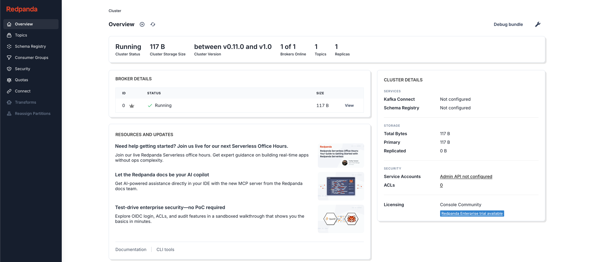

# 5단계; 실전 프로젝트 - 로컬 개발 환경 설정

> [Project Repository](https://github.com/coli-bear/ddd-ecommerce) <br/>
> - 프로젝트는 별도로 Repository 를 분리해서 관리하겠다.

먼저 테스트를 위한 로컬 개발 환경을 설정하겠다. 아래의 표를 참고하자.

| 도구/기술                   | 설명                                                            |
|-------------------------|---------------------------------------------------------------|
| Docker & Docker Compose | 컨테이너화된 환경을 쉽게 설정하고 관리하기                                       
| MariaDB                 | 하나만 설치할 예정이며, 데이터베이스를 분리해서 도메인을 표현할 예정이다.                     |
| Kafka                   | 이벤트 브로커로 사용하며, 도메인 이벤트를 처리하는 데 활용할 예정이다.                      |
| Redis                   | 알림 처리를 위해서 Redis 를 사용해서 간단한 Pub/Sub 기능을 구현할 예정이다.             |
| Elasticsearch           | 검색 기능을 위해 Elasticsearch 를 사용하며, 도메인 내에서 검색이 필요한 부분에 활용할 예정이다. |

Docker 와 Docker Compose 를 이용해서 MariaDB 와 Kafka 를 사용하겠다. 여기서는 Docker 가 설치되어 있다는 가정하에 진행하겠다.

## 1. 기본 프로젝트 구성

먼저 기본적으로 프로젝트를 실행하겠다. 여기서는 IntelliJ IDEA 에서 New Project 를 선택하고, 비어있는 프로젝트를 생성하겠다.

> 일반적으로는 각 서비스별로 프로젝트를 생성하고 각각의 Git Repository 를 생성하는 것이 좋지만, 여기서는 하나의 Repository(프로젝트) 에서 내부적으로 Spring Boot Module 로
> 분리해서 관리하겠다.

## 2. 기본적인 인프라 환경 구성

먼저 로컬 테스트 환경을 구성하기위한 파일들을 정의하겠다. 프로젝트 루트 디렉토리에 아래와 같이 디렉토리와 파일을 생성하겠다.

```text
infra/
  .env
  docker-compose.yaml
  database/
    01-create-database.sql
```

다음으로 Database 와 Kafka 구동을 위한 docker-compose.yaml 파일을 작성하겠다.

```yaml
version: "3.9"

name: ddd-devstack
services:
  mariadb:
    image: mariadb:11
    container_name: ddd-mariadb
    environment:
      MARIADB_ROOT_PASSWORD: ${MARIADB_ROOT_PASSWORD}
      MARIADB_USER: ${MARIADB_USER}
      MARIADB_PASSWORD: ${MARIADB_PASSWORD}
      # MARIADB_DATABASE: bootstrap   # 첫 DB 자동 생성이 필요하면 사용(옵션)
    ports:
      - "${MARIADB_PORT}:3306"
    volumes:
      - mariadbdata:/var/lib/mysql
      - ./database:/docker-entrypoint-initdb.d:ro

  redis:
    image: redis:7
    container_name: ddd-redis
    command: ["redis-server", "--appendonly", "yes"]
    ports:
      - "${REDIS_PORT}:6379"
    volumes:
      - redisdata:/data

  # Kafka 호환 브로커: Redpanda (ZK 없이 단일 컨테이너)
  kafka:
    image: redpandadata/redpanda:latest
    container_name: ddd-redpanda
    command:
      - redpanda
      - start
      - --overprovisioned
      - --smp=1
      - --memory=1G
      - --node-id=0
      - --check=false
      # 내부/외부 리스너
      - --kafka-addr=PLAINTEXT://0.0.0.0:${KAFKA_PORT_INTERNAL},OUTSIDE://0.0.0.0:${KAFKA_PORT_EXTERNAL}
      - --advertise-kafka-addr=PLAINTEXT://kafka:${KAFKA_PORT_INTERNAL},OUTSIDE://localhost:${KAFKA_PORT_EXTERNAL}
      - --rpc-addr=0.0.0.0:33145
      - --advertise-rpc-addr=kafka:33145
      - --mode=dev-container
    ports:
      - "${KAFKA_PORT_INTERNAL}:${KAFKA_PORT_INTERNAL}" # 컨테이너 네트워크용
      - "${KAFKA_PORT_EXTERNAL}:${KAFKA_PORT_EXTERNAL}" # 호스트 접근용
    healthcheck:
      test: ["CMD", "bash", "-c", "rpk cluster info --brokers=localhost:${KAFKA_PORT_INTERNAL} >/dev/null 2>&1"]
      interval: 5s
      timeout: 5s
      retries: 30
    depends_on:
      - mariadb
      - redis

  # Kafka UI
  redpanda-console:
    image: redpandadata/console:latest
    container_name: ddd-redpanda-console
    environment:
      KAFKA_BROKERS: "kafka:${KAFKA_PORT_INTERNAL}"
      SERVER_LISTEN_ADDRESS: "0.0.0.0:8080"
    ports:
      - "${RP_CONSOLE_PORT}:8080"
    depends_on:
      kafka:
        condition: service_healthy

volumes:
  mariadbdata:
  redisdata:
```

다음으로 .env 파일을 작성하겠다. 이 파일은 docker-compose.yaml 에서 참조하는 환경변수를 정의한다.

```env
# ===== MariaDB =====
MARIADB_ROOT_PASSWORD=devroot
MARIADB_USER=dev
MARIADB_PASSWORD=devpass
MARIADB_PORT=3306

# ===== Redis =====
REDIS_PORT=6379

# ===== Kafka (Redpanda) =====
KAFKA_PORT_INTERNAL=9092
KAFKA_PORT_EXTERNAL=19092

# ===== Redpanda Console (UI) =====
RP_CONSOLE_PORT=8082
```

마지막으로 데이터베이스 초기화를 위한 SQL 파일을 작성하겠다. 여기서는 infra/database/01-create-database.sql 파일을 생성하고, 아래와 같이 작성하겠다.

```sql
-- 바운디드 컨텍스트별 DB (필요에 맞게 추가/수정)
CREATE DATABASE IF NOT EXISTS users_db          CHARACTER SET utf8mb4 COLLATE utf8mb4_general_ci;
CREATE DATABASE IF NOT EXISTS catalog_db        CHARACTER SET utf8mb4 COLLATE utf8mb4_general_ci;
CREATE DATABASE IF NOT EXISTS orders_db         CHARACTER SET utf8mb4 COLLATE utf8mb4_general_ci;
CREATE DATABASE IF NOT EXISTS payments_db       CHARACTER SET utf8mb4 COLLATE utf8mb4_general_ci;
CREATE DATABASE IF NOT EXISTS shipping_db       CHARACTER SET utf8mb4 COLLATE utf8mb4_general_ci;
CREATE DATABASE IF NOT EXISTS subscriptions_db  CHARACTER SET utf8mb4 COLLATE utf8mb4_general_ci;
CREATE DATABASE IF NOT EXISTS notifications_db  CHARACTER SET utf8mb4 COLLATE utf8mb4_general_ci;
CREATE DATABASE IF NOT EXISTS recommendation_db CHARACTER SET utf8mb4 COLLATE utf8mb4_general_ci;

-- 앱 사용자에게 권한 부여 (env의 MARIADB_USER 사용: 예 dev/devpass)
GRANT ALL PRIVILEGES ON users_db.*          TO 'dev'@'%' IDENTIFIED BY 'devpass';
GRANT ALL PRIVILEGES ON catalog_db.*        TO 'dev'@'%' IDENTIFIED BY 'devpass';
GRANT ALL PRIVILEGES ON orders_db.*         TO 'dev'@'%' IDENTIFIED BY 'devpass';
GRANT ALL PRIVILEGES ON payments_db.*       TO 'dev'@'%' IDENTIFIED BY 'devpass';
GRANT ALL PRIVILEGES ON shipping_db.*       TO 'dev'@'%' IDENTIFIED BY 'devpass';
GRANT ALL PRIVILEGES ON subscriptions_db.*  TO 'dev'@'%' IDENTIFIED BY 'devpass';
GRANT ALL PRIVILEGES ON notifications_db.*  TO 'dev'@'%' IDENTIFIED BY 'devpass';
GRANT ALL PRIVILEGES ON recommendation_db.* TO 'dev'@'%' IDENTIFIED BY 'devpass';
```

이제 infra 디렉토리에서 Docker Compose 를 실행하겠다.

```bash
$ cd infra
$ docker-compose up -d
$ docker ps
CONTAINER ID   IMAGE                          COMMAND                  CREATED              STATUS                        PORTS                                                                       NAMES
f1d9e6d54e6b   redpandadata/redpanda:latest   "/entrypoint.sh redp…"   About a minute ago   Up About a minute (healthy)   8081-8082/tcp, 0.0.0.0:9092->9092/tcp, 9644/tcp, 0.0.0.0:19092->19092/tcp   ddd-redpanda
e94ddcac395e   redpandadata/console:latest    "./console"              4 minutes ago        Up About a minute             0.0.0.0:8082->8080/tcp                                                      ddd-redpanda-console
a63aca5a1273   redis:7                        "docker-entrypoint.s…"   4 minutes ago        Up 4 minutes                  0.0.0.0:6379->6379/tcp                                                      ddd-redis
e60fb93e5b96   mariadb:11                     "docker-entrypoint.s…"   4 minutes ago        Up 4 minutes                  0.0.0.0:3306->3306/tcp                                                      ddd-mariadb
```
위와같이 MariaDB, Redis, Kafka, Kafka UI 가 정상적으로 실행되는 것을 확인할 수 있다.

> 앞서 엘라스틱 서치 또한 추가할 수 있지만, 검색 기능은 맨 마지막에 개발할 예정이라 여기서는 생략하고 필요할 때 추가하겠다.

마지막으로 각각의 서비스가 제대로 동작하고, 설정이 잘 되어있는지 확인하겠다. 먼저 MariaDB 확인 해보자 

```bash
$ docker exec -it ddd-mariadb mariadb -udev -p -e "SHOW DATABASES;"
Enter password: 
+--------------------+
| Database           |
+--------------------+
| catalog_db         |
| information_schema |
| notifications_db   |
| orders_db          |
| payments_db        |
| recommendation_db  |
| shipping_db        |
| subscriptions_db   |
| users_db           |
```

데이터베이스가 모두 생성된 것을 확인할 수 있다. 다음으로 Redis 를 확인해보자.

```bash
$ docker exec -it ddd-redis redis-cli -p 6379 ping         
PONG
```

Redis 도 정상적으로 동작하는 것을 확인할 수 있다. 마지막으로 Kafka 를 확인해보자.

```bash
$ docker exec -it ddd-redpanda rpk topic create orders.events
TOPIC          STATUS
orders.events  OK
$ docker exec -it ddd-redpanda rpk topic list 
NAME           PARTITIONS  REPLICAS
orders.events  1           1
```

위와같이 Kafka 토픽을 생성하고, 조회할 수 있는 것을 확인할 수 있다. 이제 Kafka UI 에 접속해보자. 웹브라우저에서 http://localhost:8082 에 접속하면 다음과 같은 화면을 볼 수 있다.



자 여기까지 개발을 위한 기본 설정이 완료됐다. 다음은 각 서비스별로 Spring Boot Module 을 생성하고, 도메인 모델을 설계하고 구현하는 작업을 진행하겠다.

## 3. 주의 & 참고

이번장에서는 주의해야할 사항과 참고해야할 사항들이 있다. 아래를 참고하자.

### 1. .env 파일 

.env 는 여기서는 로컬에서 테스트를 진행하고 편하게 사용하기 위해서 gitignore 에 추가하지 않았다. 하지만 .env의 내용을 보면 데이터베이스 비밀번호, Kafka 포트 등 민감한 정보가 포함되어 있다. 따라서 실제 운영 환경에서는 .env 파일을 gitignore 에 추가하고, 민감한 정보는 별도의 안전한 방법(예: 환경 변수 관리 도구, 시크릿 매니저 등)을 통해 관리하는 것이 좋다.

### 2. 01-create-database.sql 파일

여기서는 데이터베이스 생성의 편의성을 init 스크립트를 사용했다. 이때 파일 내용중 `${MARIADB_USER}`, `${MARIADB_PASSWORD}`를 작성해 놓았는데 .sql 파일에서는 환경변수를 인식하지 못한다. 따라서 실제로는 dev/devpass 로 작성했다. 이 부분에 대해서는 로컬 DBMS 에서 여러 데이터베이스를 활용하려고하기 때문에 편의상 사용한 것이다. 운영환경에서는 절대 이렇게 사용해서는 안된다. 

### 3. Kafka 브로커

여기서는 Kafka 대신 Redpanda 를 사용했다. Redpanda 는 Kafka API 호환 브로커로 Zookeeper 없이 단일 바이너리로 동작하기 때문에 설정과 운영이 매우 간단하다. 따라서 로컬 개발 환경에서는 Redpanda 를 사용하는 것을 추천한다. 다만, 실제 운영 환경에서는 Kafka 를 사용하는 것이 일반적이므로 이 점을 유의하자.

### 4. 설치에 관한 참고사항

여기서는 DDD 학습 및 DDD를 기반으로한 MSA 형식의 프로젝트를 진행한다. 따라서 이곳에서 사용하는 인프라 환경은 container 기반으로 제공할 예정이다. 

- 개발 환경은 Docker 와 Docker Compose 를 사용한다.
- 운영 실습환경은 k8s 를 사용한다. 

즉, 각각에 필요한 인프라는 설치하지 않는다.