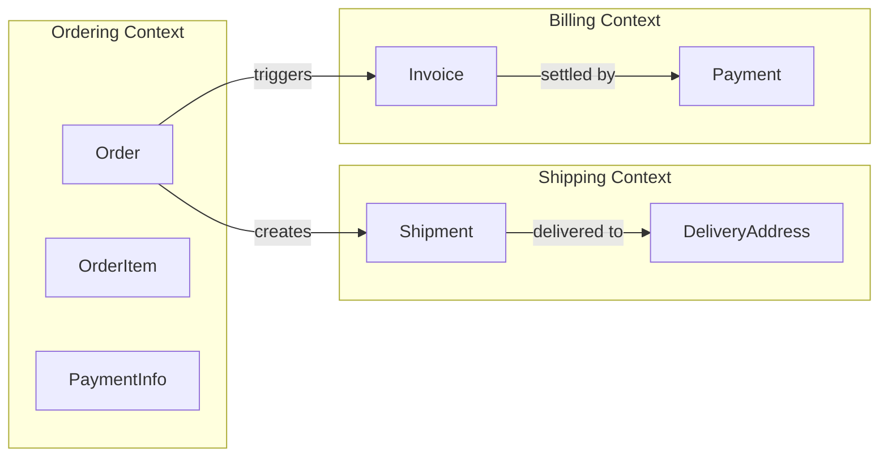
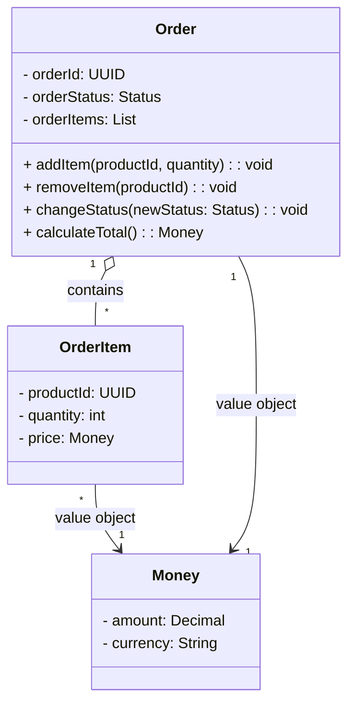

# 1단계: DDD(Domain Driven Design)의 기본 개념 및 용어

> [도메인 기본 개념 코드](../01.domain-basic-concepts)

소프트웨어 설계시 비즈니스 도메인을 중심으로 사고하고 모델링하는 방법론으로 핵심은 코드가 도메인을 반영해야 한다는 원칙이다.

DDD 의 목표는 아래와 같다.

- 개발자와 도메인 전문가가 공통의 언어로 소통하기 위함이다.
- 복잡한 도메인을 모델로 단순화 한다.
- 유지보수가 가능한 아키텍처를 확보한다.

> 참고 :
> - 도메인 : 특정 비즈니스 영역이나 문제 영역을 의미한다. 예를 들어 전자상거래 주문, 결제, 배송 등이 도메인이 될 수 있다.
> - 도메인 전문가 : 해당 비즈니스 영역에 대한 깊은 지식을 가진 사람을 의미한다.
> - 모델 : 도메인의 개념과 규칙을 코드로 표현한 것을 의미한다.

## DDD의 핵심 개념 및 용어

### 1. 유비쿼터스 언어 (Ubiquitous Language)

유비쿼터스 언어는 도메인 전문가와 개발자가 `공통으로 사용하는 언어`를 의미한다. 이 언어는 도메인의 개념, 규칙, 프로세스를 명확하게 표현하며, 모든 팀원이 동일한 용어를 사용하여 소통할 수 있도록 한다.

> 예시 :
> - 도메인 전문가가 사용하는 용어를 코드에 반영한다.
> - 예를 들어, "고객"이라는 용어를 도메인 전문가가
> - 사용한다면, 코드에서도 `Customer`라는 클래스를 사용한다.
> - 또한, "주문 생성"이라는 개념을 `createOrder()`라는 메서드로 표현한다.

### 2. 바운디드 컨텍스트 (Bounded Context)

바운디드 컨텍스트는 도메인의 경계를 정의하는 개념이다. 각 바운디드 컨텍스트는 독립적인 모델과 언어를 가지며, 서로 다른 컨텍스트 간에는 명확한 경계가 존재한다. 이를 통해 복잡한 도메인을 관리하기 쉽게 만든다.

> 예시 :
> - 전자상거래 시스템에서 "주문 관리"와 "결제 처리"는 각각 독립적인 바운디드 컨텍스트가 될 수 있다.
> - 각 컨텍스트는 자체적인 모델과 규칙을 가지며, 서로 다른 용어를 사용할 수 있다.
> - 예를 들어, "주문"이라는 개념은 주문 관리 컨텍스트에서 사용되지만, 결제 처리 컨텍스트에서는 "결제"라는 용어로 표현될 수 있다.

### 3. 애그리거트 (Aggregate)

애그리거트는 도메인 모델의 일관성을 유지하기 위한 단위이다. 애그리거트는 하나의 Entity 와 그에 관련된 VO(Value Object) 들로 구성되어 있으며, 외부에서 애그리거트에 접근하기 위해서는 항상 애그리거트 루트(Root Entity)를 통해야 한다. 이를 통해 도메인의 일관성을 보장한다.

> 예시 :
> - 주문 애그리거트는 `Order`(애그리거트 루트)와 `OrderItem`(Value Object)로 구성될 수 있다.
> - 외부에서는 `Order`를 통해서만 주문 항목에 접근할 수 있다.
> - `Order`는 주문의 상태를 변경하거나 항목을 추가/삭제하는 메서드를 제공한다.

