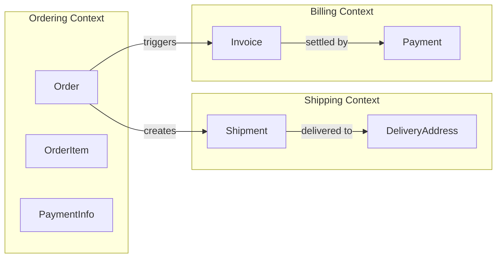
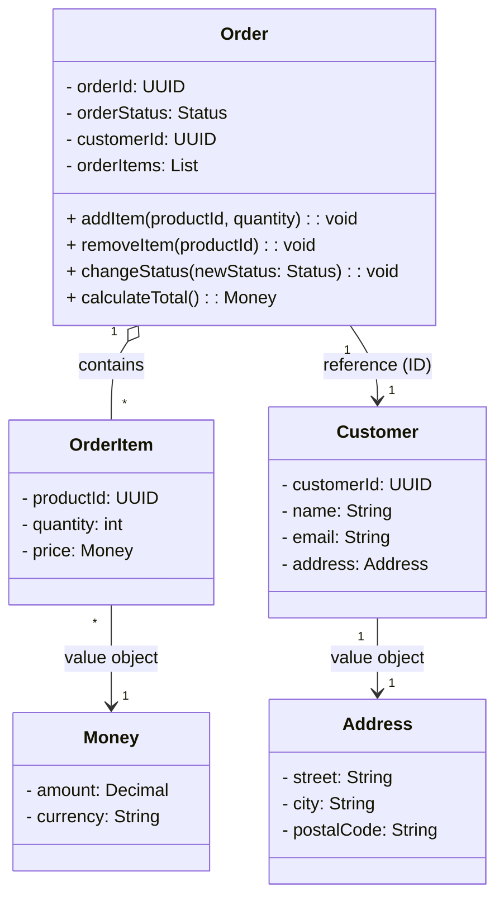

# 1단계: DDD(Domain Driven Design)의 기본 개념 및 용어

> [도메인 기본 개념 코드](../01.domain-basic-concepts)

소프트웨어 설계시 비즈니스 도메인을 중심으로 사고하고 모델링하는 방법론으로 핵심은 코드가 도메인을 반영해야 한다는 원칙이다.

DDD 의 목표는 아래와 같다.

- 개발자와 도메인 전문가가 공통의 언어로 소통하기 위함이다.
- 복잡한 도메인을 모델로 단순화 한다.
- 유지보수가 가능한 아키텍처를 확보한다.

> 참고 :
> - 도메인 : 특정 비즈니스 영역이나 문제 영역을 의미한다. 예를 들어 전자상거래 주문, 결제, 배송 등이 도메인이 될 수 있다.
> - 도메인 전문가 : 해당 비즈니스 영역에 대한 깊은 지식을 가진 사람을 의미한다.
> - 모델 : 도메인의 개념과 규칙을 코드로 표현한 것을 의미한다.

## DDD의 핵심 개념 및 용어

### 1. 유비쿼터스 언어 (Ubiquitous Language)

유비쿼터스 언어는 도메인 전문가와 개발자가 `공통으로 사용하는 언어`를 의미한다. 이 언어는 도메인의 개념, 규칙, 프로세스를 명확하게 표현하며, 모든 팀원이 동일한 용어를 사용하여 소통할 수 있도록 한다.

> 예시 :
> - 도메인 전문가가 사용하는 용어를 코드에 반영한다.
> - 예를 들어, "고객"이라는 용어를 도메인 전문가가
> - 사용한다면, 코드에서도 `Customer`라는 클래스를 사용한다.
> - 또한, "주문 생성"이라는 개념을 `createOrder()`라는 메서드로 표현한다.

### 2. 바운디드 컨텍스트 (Bounded Context)

바운디드 컨텍스트는 도메인의 경계를 정의하는 개념이다. 각 바운디드 컨텍스트는 독립적인 모델과 언어를 가지며, 서로 다른 컨텍스트 간에는 명확한 경계가 존재한다. 이를 통해 복잡한 도메인을 관리하기 쉽게 만든다.

> 예시 :
> - 전자상거래 시스템에서 "주문 관리"와 "결제 처리"는 각각 독립적인 바운디드 컨텍스트가 될 수 있다.
> - 각 컨텍스트는 자체적인 모델과 규칙을 가지며, 서로 다른 용어를 사용할 수 있다.
> - 예를 들어, "주문"이라는 개념은 주문 관리 컨텍스트에서 사용되지만, 결제 처리 컨텍스트에서는 "결제"라는 용어로 표현될 수 있다.

아래는 전자상거래 시스템의 바운디드 컨텍스트 예시이다.



### 3. 엔티티 (Entity)

엔티티는 도메인 모델의 핵심 요소로 도메인의 상태와 행동을 캡슐화한다. 이러한 엔티티는 고유한 식별자를 갖으며, 시간이 지나도 동일한 개체로 인식된다. 이 때 엔티티는 식별자를 통해서 구분된다.

> 예시 :
> - `Customer`(고객) 엔티티는 고유한 고객 ID를 가지며, 이름, 이메일, 주소 등의 상태를 포함할 수 있다.
> - `Order`(주문) 엔티티는 고유한 주문 ID를 가지며, 주문 상태, 주문 항목, 결제 정보 등의 상태를 포함할 수 있다.
> - 엔티티는 도메인의 규칙에 따라 행동하는 메서드를 가질 수 있다. 예를 들어, `Order` 엔티티는 주문 상태를 변경하는 메서드를 가질 수 있다.

아래는 `Customer`와 `Order` 엔티티의 예시 코드이다.

```java

@Setter
@Getter
@AllArgsConstructor
@Builder
class Customer {
    private UUID customerId; // 고유 식별자
    private String name;
    private String email;
    private Address address; // Value Object

    // 도메인 규칙에 따른 행동 메서드
    public void updateEmail(String newEmail) {
        // 이메일 형식 검증 등의 로직
        this.email = newEmail;
    }
}

@Setter
@Getter
@AllArgsConstructor
@Builder
class Order {
    private UUID orderId; // 고유 식별자
    private List<OrderItem> orderItems; // Value Object
    private OrderStatus status;

    // 도메인 규칙에 따른 행동 메서드
    public void addItem(OrderItem item) {
        if (this.status == OrderStatus.CANCELLED) {
            throw new IllegalStateException("취소된 주문에는 항목을 추가할 수 없습니다.");
        }
        this.orderItems.add(item);
    }

    public void changeStatus(OrderStatus newStatus) {
        // 상태 변경 로직
        this.status = newStatus;
    }
}
```

### 4. VO (Value Object)

VO(Value Object)는 도메인 모델에서 속성의 집합을 나타내며, 고유한 식별자가 없다. VO는 불변(immutable)하며, 동일한 속성 값을 가지는 VO는 동일한 것으로 간주된다. VO는 주로 엔티티의
속성으로 사용된다.

> 예시 :
> - `Address`(주소) VO는 거리, 도시, 우편번호 등의 속성을 포함할 수 있다.
> - `Money`(금액) VO는 금액과 통화 단위를 포함할 수 있다.
> - VO는 불변성을 유지하기 위해 생성자에서 모든 속성을 설정하며, 이후에는 변경할 수 없다.

아래는 `Address` VO의 예시 코드이다.

```java

@EqualsAndHashCode
class Address {
    private final String street;
    private final String city;
    private final String postalCode;

    public Address(String street, String city, String postalCode) {
        this.street = street;
        this.city = city;
        this.postalCode = postalCode;
    }
}
```

#### 4.1. VO vs Entity

| 구분    | VO (Value Object)     | Entity (엔티티)             |
|-------|-----------------------|--------------------------|
| 식별자   | 없음                    | 고유한 식별자 (예: ID)          |
| 불변성   | 불변 (immutable)        | 상태 변경 가능                 |
| 동일성   | 속성 값이 동일하면 동일한 것으로 간주 | 식별자를 통해 구분               |
| 사용 목적 | 속성의 집합을 나타내기 위해 사용    | 도메인의 상태와 행동을 캡슐화하기 위해 사용 |
| 예시    | 주소, 금액, 날짜 등          | 고객, 주문, 제품 등             |       

### 5. 애그리거트 (Aggregate)

애그리거트는 도메인 모델의 일관성을 유지하기 위한 단위이다. 애그리거트는 하나의 Entity 와 그에 관련된 VO(Value Object) 들로 구성되어 있으며, 외부에서 애그리거트에 접근하기 위해서는 항상
애그리거트 루트(Root Entity)를 통해야 한다. 이를 통해 도메인의 일관성을 보장한다.

> 예시 :
> - 주문 애그리거트는 `Order`(애그리거트 루트)와 `OrderItem`(Value Object)로 구성될 수 있다.
> - 외부에서는 `Order`를 통해서만 주문 항목에 접근할 수 있다.
> - `Order`는 주문의 상태를 변경하거나 항목을 추가/삭제하는 메서드를 제공한다.

아래는 주문 애그리거트의 예시 다이어그램이다.



그 외에도 바운디드 컨텍스트간의 관계는 `Consumer/Supplier`, `Conformist`, `Anti-Corruption Layer` 등 다양한 패턴이 존재한다. 이는 추후 전략적 패턴에서 다룬다.

## 최종 요약 정리

### 용어

- `유비쿼터스 언어` : 도메인 전문가와 개발자가 공통으로 사용하는 언어
- `바운디드 컨텍스트` : 도메인의 경계를 정의하는 개념
- `엔티티` : 고유한 식별자를 가지며, 도메인의 상태와 행동을 캡슐화하는 객체
- `VO` : 고유한 식별자가 없으며, 불변성을 가지는 속성의 집합
- `애그리거트` : 도메인 모델의 일관성을 유지하기 위한 단위, 애그리거트 루트를 통해 외부 접근을 제어

### 장점

- 비즈니스 도메인을 중심으로 설계하여 복잡한 도메인을 효과적으로 관리
- 도메인 전문가와 개발자 간의 원활한 소통 가능
- 명확한 경계와 책임 분리로 유지보수가 쉬움
- 애그리거트를 통해 도메인의 일관성을 유지
- 바운디드 컨텍스트를 통해 복잡한 도메인을 작은 단위로 나누어 관리
- 새로운 기능 추가 시 기존 도메인 모델에 영향을 최소화하여 확장 가능

### 단점

- DDD의 개념과 원칙을 이해하는 데 시간이 걸림
- 초기 설계에 많은 시간과 노력이 필요
- 잘못된 적용 시 오히려 복잡성을 증가시킬 수 있음
- 단순한 도메인에는 과도한 설계가 될 수 있음
- 주요 도메인 규칙 변경 시 애그리거트와 바운디드 컨텍스트 전반에 영향을 미칠 수 있음